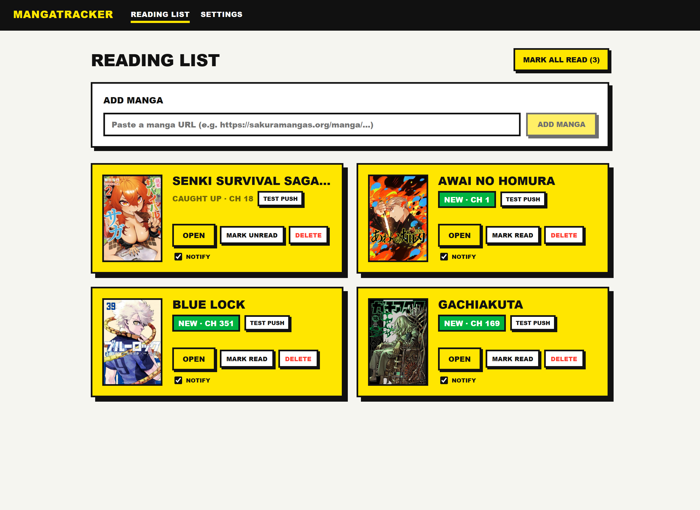

# MangaTracker

Track the manga you read, and get a **push notification on your phone** the moment a new chapter drops.

Add a manga by pasting its URL. The backend scrapes the source once a day, detects new chapters, and pushes a notification to every device you've subscribed. A neo-brutalist dashboard shows what's new at a glance.



## Features

- **Add manga by URL** — paste a source link, the scraper fetches the title, cover, and latest chapter.
- **Web push notifications** — real browser/phone push (no email). Works on Android and installed iOS PWAs.
- **Daily chapter check** — scheduled scrape every day at 08:00 (America/São_Paulo); new chapters trigger a push.
- **Per-manga notify toggle** — mute titles you don't care about.
- **Read / unread tracking** — mark chapters read, "NEW" badge for anything you haven't caught up on.
- **Test push** — one button per card to verify notifications reach your device.
- **Installable PWA** — add to home screen, launches like a native app.

## Tech Stack

| Layer     | Technology                                         |
|-----------|----------------------------------------------------|
| Backend   | Spring Boot 3.4 · Java 21 · Gradle · Jakarta EE 10 |
| Frontend  | Angular 22 · TypeScript · SCSS · Service Worker    |
| Database  | PostgreSQL 16 · Flyway migrations                  |
| Push      | Web Push (VAPID) · `nl.martijndwars:web-push`      |
| Scraping  | Playwright (stealth) · rendered-DOM scrape         |
| Testing   | JUnit 5 · Mockito · Testcontainers · Playwright    |
| Container | Docker · docker compose                            |

## Quick Start

```bash
git clone <repo-url>
cd manga-tracker

# 1. generate VAPID keys for web push (see below) and put them in .env
cp .env.example .env
# edit .env with your generated keys, JWT_SECRET, and account passwords

# 2. start the stack
docker compose up
```

App: **<http://localhost:4200>** once all services report healthy.

> First startup builds the images and downloads Playwright's browser — give it a few minutes.

## Web Push Setup (VAPID)

Push notifications are signed with a **VAPID key pair**. Generate one once:

```bash
npx web-push generate-vapid-keys
```

Put the output in `.env` at the repo root:

```dotenv
VAPID_PUBLIC_KEY=<public key>
VAPID_PRIVATE_KEY=<private key>
VAPID_SUBJECT=mailto:you@example.com
```

docker compose passes these to the backend automatically. Without them the app still
runs, but the push endpoints return an error when you try to subscribe.

> **Keep the private key secret.** Never commit `.env`. The public key is safe to expose.

## Testing Push on Your Phone

Service workers require a **secure (HTTPS) context** — `localhost` is exempt, but a
phone on your LAN hitting `http://<your-ip>:4200` is **not**, so push won't work there.
Expose the app over HTTPS with a quick tunnel:

```bash
cloudflared tunnel --url http://localhost:4200
```

This prints a temporary `https://<random>.trycloudflare.com` URL. Then on your phone:

1. Open that URL in **Chrome (Android)** or **Safari (iOS 16.4+)**.
2. *(iOS only)* **Add to Home Screen** and open the app from there — iOS only allows
   push from an installed PWA.
3. Tap **Notify** on a manga card and grant the notification permission.
4. Tap **Test push** — a notification should appear on your phone.

## Local Development (Without Docker)

**Backend** (Java 21) — needs a local PostgreSQL:

```bash
cd backend
./gradlew bootRun
```

API on **<http://localhost:8080>**.

**Frontend** (Node 24.15+):

```bash
cd frontend
npm install
npm start
```

Dev server on **<http://localhost:4200>**, proxies `/api` to `localhost:8080`.

## Environment Variables

| Variable             | Default                                          | Description                          |
|----------------------|--------------------------------------------------|--------------------------------------|
| `DB_URL`             | `jdbc:postgresql://localhost:5432/manga_tracker` | JDBC connection URL                  |
| `DB_USERNAME`        | `manga_tracker`                                  | PostgreSQL username                  |
| `DB_PASSWORD`        | `manga_tracker`                                  | PostgreSQL password                  |
| `JWT_SECRET`         | *(required)*                                     | JWT signing secret, at least 32 bytes|
| `VAPID_PUBLIC_KEY`   | *(empty)*                                        | VAPID public key for web push        |
| `VAPID_PRIVATE_KEY`  | *(empty)*                                        | VAPID private key (keep secret)      |
| `VAPID_SUBJECT`      | `mailto:…`                                       | VAPID subject (contact mailto/URL)   |
| `SCRAPER_TIMEOUT_MS` | `10000`                                          | Per-request scraper timeout (ms)     |

In docker compose, DB vars are set automatically and VAPID vars come from `.env`.

## Quality Gates

```bash
# backend
cd backend
./gradlew spotlessApply             # format
./gradlew test jacocoTestReport     # tests + coverage (needs Docker for Testcontainers)

# frontend
cd frontend
npm run format && npm test && npm run lint
npm run e2e                         # Playwright, mocked backend
```

## Documentation

- [API Concepts](docs/api.md) — auth, CSRF, demo behavior, rate limits, and error format. Full endpoint reference is generated at `http://localhost:8080/swagger-ui.html`.
- [Architecture Overview](docs/architecture.md)
- [AWS Deployment Runbook](docs/aws-deployment.md)
- [New Developer Onboarding](docs/onboarding.md)
- [Developer Guide](docs/developer-guide.md)
- [Agent Workflow (Codex + Claude)](docs/agent-workflow.md)
